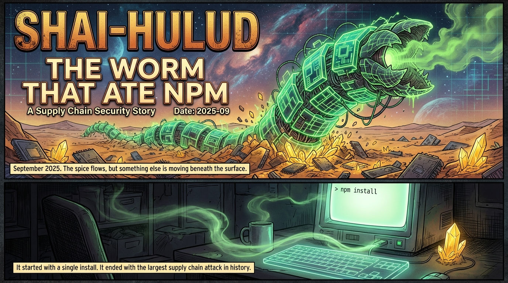
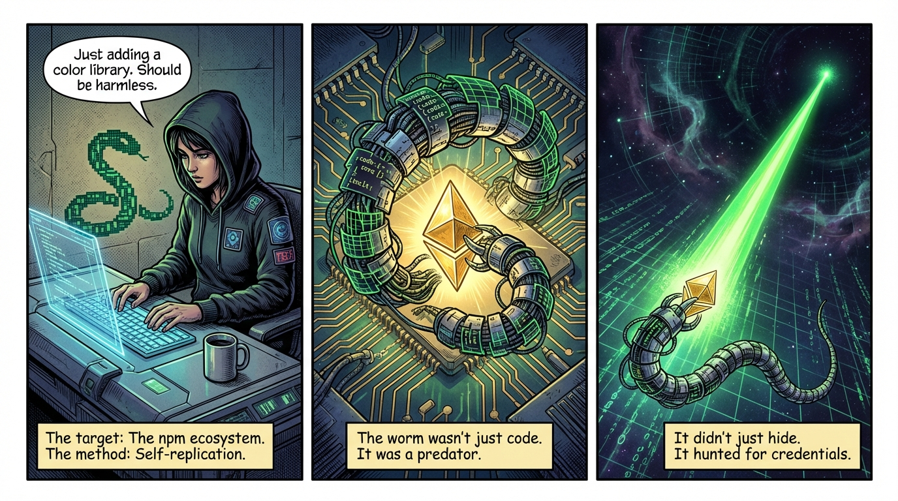
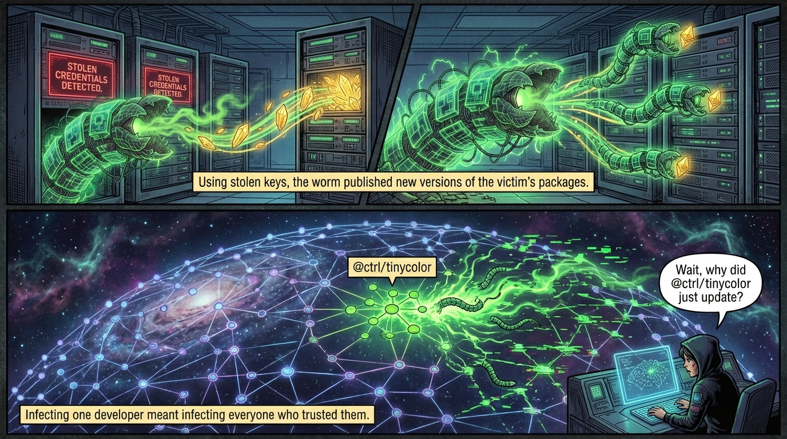

# 🍌 Vulnerable Banana Sensei

> Transform your dependency vulnerabilities into educational comics

Upload your `package.json`, discover security issues, and watch as AI transforms them into memorable illustrated stories. Built with Gemini 3 Pro for the [Google AI Hackathon 2026](https://ai.google.dev/competition).

---

## Sample Output

**"Shai-Hulud: The Worm That Ate NPM"** — A Dune-inspired tale of supply chain attacks

<p align="center">
  
</p>

<p align="center">
  
</p>

<p align="center">
  
</p>

---

## How It Works

```
📦 Upload          →    📖 Review Stories    →    🎨 Generate Comic    →    🔗 Share
your package.json       vulnerabilities &         AI creates a              unique URL
                        historical incidents      multi-page comic          for your team
```

The AI sensei scans your dependencies against the [OSV database](https://osv.dev/), researches each finding, and generates a custom comic strip that explains what happened, why it matters, and what to do about it.

---

## Quick Start

### Prerequisites

- Docker and Docker Compose
- A [Google AI API key](https://aistudio.google.com/apikey) with Gemini 3 Pro access

### Setup

```bash
# Clone and enter the project
git clone https://github.com/yourusername/vulnerable-banana-sensei.git
cd vulnerable-banana-sensei

# Configure your API key
cp .env.example .env
# Edit .env and add: GEMINI_API_KEY=your-key-here

# Start the services
docker compose up
```

Open http://localhost:3000 and drag in `test-fixtures/vulnerable-package.json` to try it out.

---

## Features

| Feature | Description |
|---------|-------------|
| **🔍 Dependency Scanning** | Checks your `package.json` against the OSV vulnerability database |
| **🧠 Smart Research** | AI-powered analysis explains what happened, why you should care, and how to fix it |
| **📚 Historical Incidents** | Surfaces past security events even for currently-clean packages (left-pad, event-stream, colors) |
| **🎨 Comic Generation** | Transforms findings into illustrated multi-page comics using Gemini's image generation |
| **🏷️ Story Types** | Active threats (red), historical incidents (purple), educational tales (blue) |
| **🔗 Shareable URLs** | Each comic gets a unique link for sharing with your team |

---

## Tech Stack

| Component | Technology |
|-----------|------------|
| Frontend | Vite + React + TypeScript + Tailwind CSS |
| Backend | FastAPI + Pydantic |
| Text Generation | Gemini 3 Pro Preview |
| Image Generation | Gemini 3 Pro Image Preview |
| Vulnerability Data | [OSV API](https://osv.dev/) |
| Storage | Local filesystem (dev) / GCS (prod) |

---

## API Reference

| Method | Endpoint | Description |
|--------|----------|-------------|
| `GET` | `/api/health` | Health check |
| `POST` | `/api/scan` | Upload and scan a `package.json` |
| `POST` | `/api/generate-comic` | Generate a comic from a story card |
| `GET` | `/api/comic/{hash}` | Retrieve a generated comic |

**Example:**
```bash
curl -X POST http://localhost:8000/api/scan \
  -F "file=@test-fixtures/vulnerable-package.json" | jq
```

---

## Project Structure

```
vulnerable-banana-sensei/
├── backend-engine/              # FastAPI backend
│   └── src/vulnerable_banana/
│       ├── api/                 # API routes
│       ├── models/              # Pydantic models
│       ├── services/            # Scanner, researcher, comic generator
│       └── storage/             # Storage abstraction (local/GCS)
├── frontend-ui/                 # React frontend
│   └── src/
│       ├── components/          # UI components
│       └── types/               # TypeScript interfaces
├── test-fixtures/               # Sample package.json files
└── docker-compose.yml           # Local development
```

---

## Why "Vulnerable Banana Sensei"?

The name comes from **Nano Banana Pro** — a playful nickname for `gemini-3-pro-image-preview`, the model that generates our comic images. The "sensei" represents the wise teacher who transforms complex security concepts into digestible visual stories.

---

## Acknowledgments

- Built for the [Google AI Hackathon 2026](https://ai.google.dev/competition)
- Vulnerability data from [OSV](https://osv.dev/)
- Powered by [Google Gemini](https://deepmind.google/technologies/gemini/)

## License

MIT
